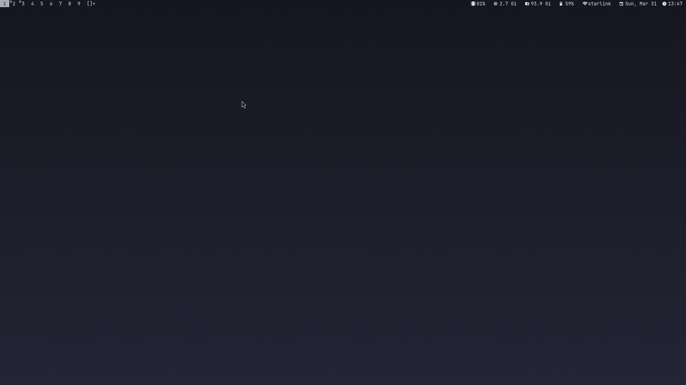
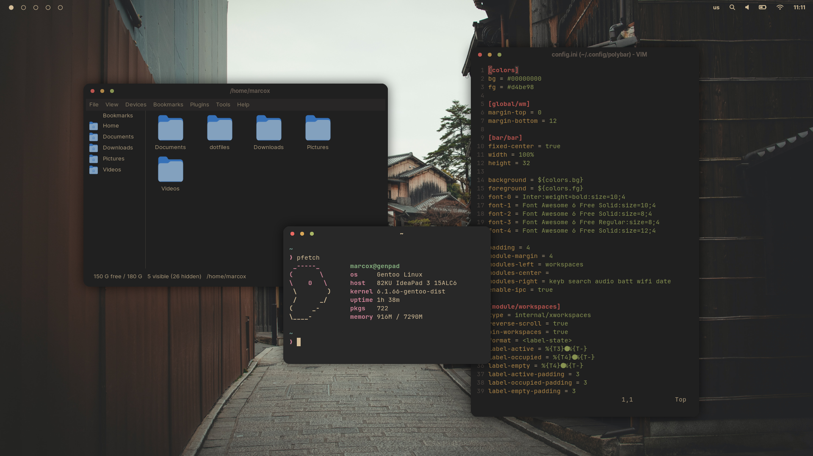
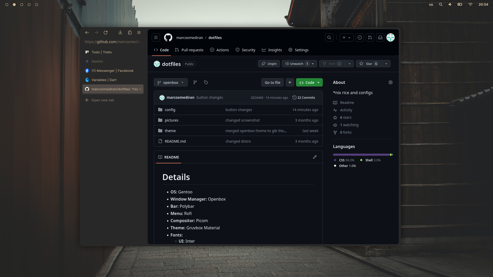

# Details
- **OS:** Gentoo
- **Window Manager:** Openbox
- **Bar:** Polybar
- **Menu:** Rofi
- **Compositor:** Picom
- **Theme:** Gruvbox Material
- **Fonts:**
    - **UI:** Inter
    - **Icons:** Font Awesome 6 Free
    - **Terminal:** JetBrainsMono Nerd Fonts

##

